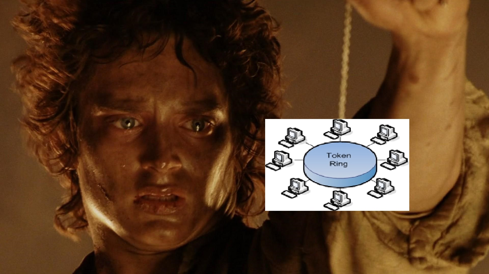

## But Why?
Look, we all know networking is important. 

In fact, without networking, none of the services or applications that make businesses run would be possible.

But I can't help the feeling that networking could be more *interesting* to learn. Naturally, that leads to finding something familiar to connect with. In my case, that such thing is Lord of the Rings.

## I know what you're thinking
"This is going to be painful". No, not really. Well... maybe just a little. Anyway, we're doing it so let's get to it!

One quick note- let's say the fellowship of the ring is at the center. After all, wherever the Ring goes is typically the focal point of the story.

## Before Protocls: OSI
Ahh, the OSI model. Or by it's formal dinner name: the Open Systems Interconnection model. As one of the most well-known and important models in all of information technology, I thought it important to cover this topic. Throughtout each of the seven layers, various protocols enable network communications. 

Transmission Control Protocol (TCP) is connection-oriented; data is sent only after a connection is made between applications.
Internet Protocl (IP) routes data by controlling information like source and destination IP addresses for network-to-network connections.

## One Ring to Rule Them All...

This first one is not necessarily a protocol, but we're including it anyway because it's important (and because we can): the Token Ring data link.

> One ring to rule them all, one ring to find them, One ring to bring them all, and in the darkness bind them; In the Land of Mordor where the shadows lie.

Just like the One Ring, the token ring data link is key to binding hosts in a local area network (LAN). In the interest of being fair, you could also use Ethernet to connect hosts in a LAN.

Token Ring, however, has a few advantages over Ethernet. Namely, Token is *insanely* close to Tolkein. So, bonus points for that alone. Let's also keep in mind that token ring can determine priority and uses a star topology rather than a bus topology. All the characters, plotlines, and actions center around Frodo and the One Ring so... seems good to me!

## HTTP: The Beacon-hills of Gondor

Ignoring the fact that this scene from *The Return of the King* is a [lie](https://gamerant.com/lotr-lord-of-the-rings-best-scenes-gondor-beacons-changes/), it's still a pretty good representation of HTTP.

Hypertext Transfer Protocol is a client-server protocol: requests are sent by one entity to a server, which then handles it and provides a response. There are numerous entities between the client and the server. A perfect fit for our beacon analogy!

Pippin, being the one initiating the request for Rohan's aid (in the movie) acts as the browser (which is always the entity initiating the request). The beacons are lit one-by-one, across seven foot-hills (thirteen in the book), to eventually reach King Theoden of Rohan- I guess he's the server in this case? Anyway, a response is returned that Rohan will come to the aid of Gondor... albeit not back through the same system the request was sent. Details, minor details.

### But what if the beacon signal was intercepted?

HTTP sends data in plaintext, making it inherently insecure. That aligns with the LOTR story; I mean, it's just giant flames on the top of a mountain, not much encryption being done there. I think anyone seeing that would know something is up; in fact, I would be surprised if Sauron did not know of the beacon communication system.

## Telnet/SSH: Pippin Gazing into the Palantir

This is actually one of my favorite comparisons to make in this post. Pippin actually carried his team so hard by making this move, albeit unintentionally. Some background: the spherical stone Pippin gazes into in *The Two Towers* is one of seven [palantiri](https://tolkiengateway.net/wiki/Palant%C3%ADri)- AKA "seeing stones", anyone holding palantiri could see the from the other side of the stone from anywhere. This is how Sauron and Saruman were able to communicate from Mordor and Isengard. That very stone is the one Pippin looks through.

From the networking perspective, I was going to make the connection here with SSH. After thinking about it a little harder, though, Telnet might be a better analogy. Pippin, after all, was able to gaze into the palantir and see the other side without any sort of encryption/decryption or authentication... although it is unclear whether the two palantiri were already "connected". Maybe the palantir system uses public key cryptography and Sauron/Saruman had each others' private key.

## That's All for Now

This has been a fun thought experiment. I'll have to think a little harder about DNS, (S)FTP, and the others. Hopefully this has been helpful for anyone struggling with the networking portion of their studies or certifications.